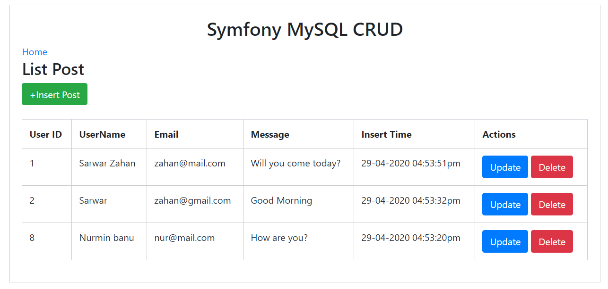
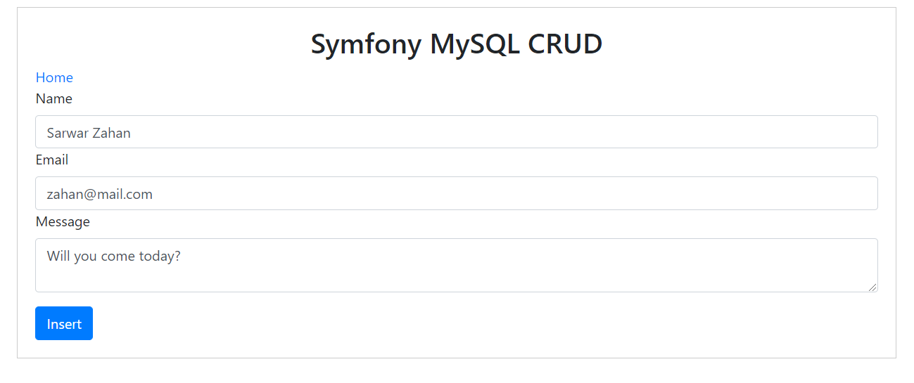
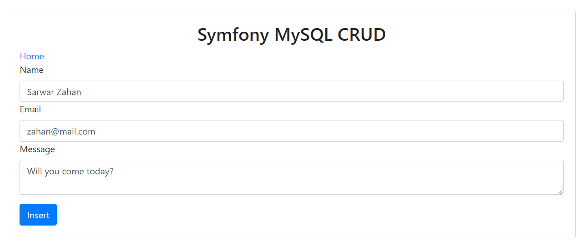
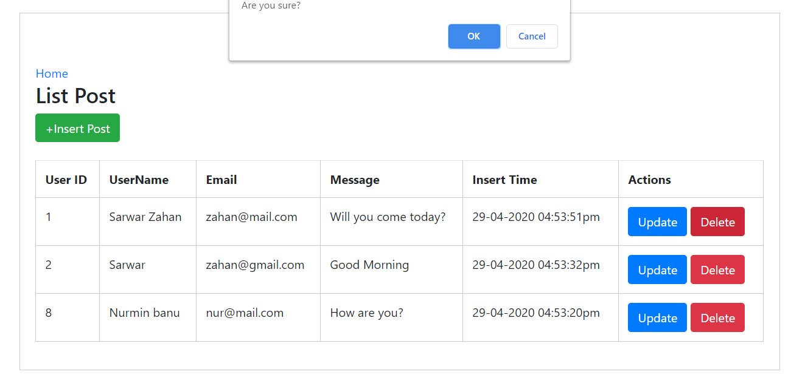

## Symfony(5) Bootstrap(4) MySQL CRUD

This application is dedicated to the MySQL database. I have added Bootstrap 4 just for nice UI. You can download and use this file without any obligation. I have added some screenshot below.

## Screenshot of post list

## Screenshot of post insert

## Screenshot of post update

## Screenshot of post delete

## License

Code are free to use  under the [MIT license](https://opensource.org/licenses/MIT).
